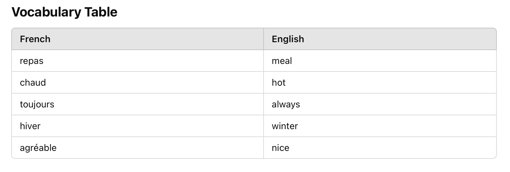

## Sentences used and their results :

A hot meal is always nice in winter.

### ChatGPT responded:

### Vocabulary Table

### Sentence Structure

[A] + [hot] + [meal] + [is] + [always] + [nice] + [in] + [winter]

### Clues and Considerations

In French, nouns need an article ("a" translates as un or une).
"Hot" is an adjective and must agree with the noun.
The verb to be (être) is required in the correct conjugation.
"In winter" translates differently than in English; it's a set phrase.
Give it a try! 😊

### You said:
Un repas chaud est toujours agréable en hiver.

### ChatGPT said:
✅ Correct! Well done!

Your sentence reads exactly as intended:

A hot meal is always nice in winter.

### Summary of findings: 

Although I specifially said don't give more than 3 rows of vocabulary , it gave all the words in the sentence . 

I prompted it again emphasising on that , and then I got it correctly. 