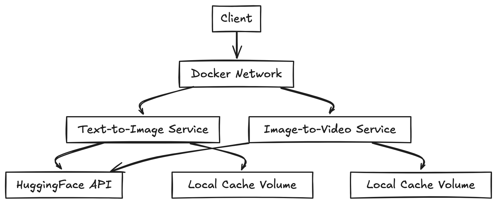

# Technical Specifications

## System Architecture

### Overview
The system consists of two main microservices:
- Text-to-Image Generation Service
- Image-to-Video Generation Service

Both services are containerized and orchestrated using Docker Compose.




## Service Specifications

### Text-to-Image Service

#### Technical Details
- **Runtime**: Python 3.9+
- **Framework**: FastAPI
- **Model**: Stable Diffusion 2.1
- **Port**: 9379
- **Container Memory**: Minimum 8GB recommended
- **Disk Space**: ~4GB for model weights
- **GPU Support**: Optional, falls back to CPU

#### Dependencies
```text
torch==2.0.0+
diffusers==0.24.0
transformers==4.31.0
fastapi==0.100.0
uvicorn==0.23.0
safetensors==0.3.1
accelerate==0.21.0
```

#### API Endpoints
- `GET /health`
  - Health check endpoint
  - Returns: `{"status": "healthy"}`

- `POST /v1/text2image`
  - Input Schema:
    ```json
    {
      "prompt": "string",
      "num_images_per_prompt": "integer (default: 1)"
    }
    ```
  - Output Schema:
    ```json
    {
      "status": "string",
      "images": ["base64_encoded_string"],
      "message": "string"
    }
    ```

### Image-to-Video Service

#### Technical Details
- **Runtime**: Python 3.9+
- **Framework**: FastAPI
- **Model**: Stable Video Diffusion
- **Port**: 9369
- **Container Memory**: Minimum 8GB recommended
- **Disk Space**: ~6GB for model weights
- **GPU Support**: Optional, falls back to CPU

#### Dependencies
```text
torch==2.0.0+
diffusers==0.24.0
transformers==4.31.0
fastapi==0.100.0
uvicorn==0.23.0
safetensors==0.3.1
accelerate==0.21.0
pillow==10.0.0
requests==2.31.0
```

#### API Endpoints
- `GET /health`
  - Health check endpoint
  - Returns: `{"status": "healthy"}`

- `POST /v1/image2video`
  - Input Schema:
    ```json
    {
      "images_path": [
        {
          "image_path": "string (URL or base64)"
        }
      ]
    }
    ```
  - Output Schema:
    ```json
    {
      "status": "string",
      "frames": ["base64_encoded_string"],
      "message": "string"
    }
    ```

## Docker Configuration

### Network Configuration
- Network Mode: Bridge
- Internal Network Name: opea-network
- Exposed Ports: 9379, 9369

### Volume Configuration
- text2image_cache: Persistent volume for model weights
- image2video_cache: Persistent volume for model weights

### Resource Limits
```yaml
services:
  text2image:
    deploy:
      resources:
        limits:
          memory: 8G
        reservations:
          memory: 4G

  image2video:
    deploy:
      resources:
        limits:
          memory: 8G
        reservations:
          memory: 4G
```

## Performance Considerations

### Text-to-Image Service
- Average inference time (CPU): 10-15 seconds
- Average inference time (GPU): 2-4 seconds
- Memory usage during inference: 4-6GB
- Concurrent request handling: 1 request at a time (default)

### Image-to-Video Service
- Average inference time (CPU): 20-30 seconds
- Average inference time (GPU): 5-8 seconds
- Memory usage during inference: 6-8GB
- Concurrent request handling: 1 request at a time (default)

## Security Considerations

### Authentication
- Hugging Face token required for model access
- No built-in endpoint authentication (should be implemented based on needs)

### Data Privacy
- All processing done locally
- No data sent to external services except model downloads
- Base64 encoding used for data transfer

### Network Security
- Services isolated in Docker network
- Only necessary ports exposed
- No direct internet access required after model download

## Error Handling

### Common Error Codes
- 400: Bad Request (Invalid input)
- 500: Internal Server Error (Model failure)
- 503: Service Unavailable (Model loading)

### Error Response Format
```json
{
  "detail": "error_message",
  "status_code": integer
}
```

## Monitoring and Logging

### Logging Configuration
- Level: DEBUG (configurable)
- Format: JSON
- Timestamps: UTC

### Health Checks
- Interval: 30 seconds
- Timeout: 10 seconds
- Retries: 3

### Metrics
- Model loading time
- Inference time
- Memory usage
- Request success/failure rate

## Scaling Considerations

### Horizontal Scaling
- Services can be replicated
- Requires load balancer configuration
- Stateless design

### Vertical Scaling
- CPU scaling supported
- GPU scaling supported
- Memory scaling supported

## Development and Testing

### Local Development
```bash
# Start services in development mode
docker-compose -f docker-compose.dev.yml up
```

### Testing
```bash
# Run unit tests
python -m pytest tests/

# Run integration tests
python -m pytest tests/integration/
```

### CI/CD Integration
- GitHub Actions compatible
- Docker Hub integration ready
- Automated testing support

## Known Limitations

1. Single request processing at a time
2. No built-in request queuing
3. High memory requirements
4. CPU inference is slow
5. No automatic model updating
